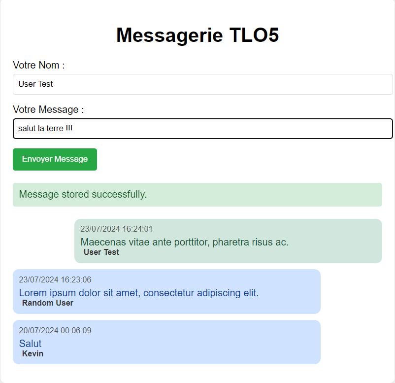

# Création d'une API de messagerie instantatnée
Afin de mieux cerner le fonctionnement d'une API j'ai créé une API qui permet d'échanger des messages instantanés. 
Une interface a aussi été mise en place afin de rendre l'ensemble plus confortable à utiliser. 
Vous pouvez tester cette messagerie sur [ICI](https://kevinrajon.fr/messagerie).
### Etapes de développement
  - Création d'un index.php et d'un fichier JSON vide pour stocker les messages 
  - Création des méthodes POST et GET 
  - Test des méthodes POST et GET avec Postman
  - Création d'une interface en HTML
  - Création d'un script en JS afin de rendre l'interface utilisable
  - Mise en place de messages d'erreur et des sécurités de base contre les injections xss et autres
  - Amélioration de l'interface afin de la rendre plus attrayante
### Voici le résultat final 

